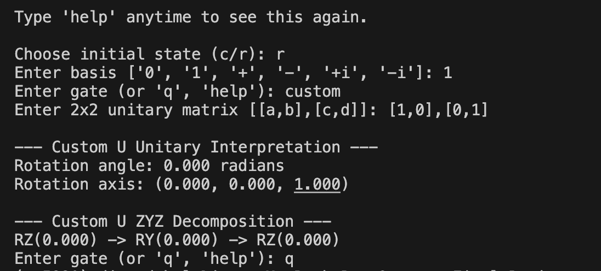

# Project Report - Bloch Sphere Quantum Simulator

## Summary of Results

- The following project is a Python based interactive simulator for visualizing single qubit 
quantum states and gates on the Bloch sphere. It supports standard quantum gates, rotation gates, 
measurement, and custom unitary matrices. We believe this project falls in correct scope and does
explore sufficient technical depth to meet rubric requires.

**Technical Content**
- We compute Bloch coordinates from statevectors by taking the statevector `ψ` and computing its expectation values with the Pauli matrices `X, Y, Z` or any other viable gates. This can be observed in our function named `bloch_vector()`, which follows the following steps listed below to achieve the desired result.
    1. Normalize the given state .
    2. compute: $x = ψ^†Xψ$, $y = ψ^†Yψ$, $z = ψ^†Zψ$, which gives us the 3D point `(x,y,z)` on the Bloch sphere.
- We verify unitarity numerically by checking whether a matrix `U` satisfies $U^†U = I$. This can be observed in our function named `is_unitary(U, tol=1e-9)` where we compute `U.conj().T @ U`. Then we compare it to the identity matrix using `np.allclose(...)`. if the matrix matches it is considered unitary.
- Rotations are implemented using the closed-form rotation formulas, not matrix exponentials. This can be observed in our functions named `rx(theta), ry(theta), rz(theta)`. Here, a rotation is implemented as: $R_X(θ) = cos(θ/2)I − isin(θ/2)X$. Then we directly compute the cosine and sine to build the matrix using the Pauli matrices.
- We also implemented custom quantum gates. A custom gate can be defined using a 2×2 matrix, for example`x_gate = [[1, 0], [1, 0]]`. Applying this gate is similar to applying the standard X gate, and its effect can be visualized on the Bloch sphere. 
- We simulate a Z-basis measurement in three steps using our function `measure_z(self, rng=None)`. This function follows the steps listed below to achieve the desired result.
    1. Compute probabilities: $P(0) = |\alpha|^2$, $P(1) = |\beta|^2$ by taking the squared magnitudes of the statevector components.
    2. Sample a random outcome by generating a random number and choosing 0 or 1 based on those probabilities.
    3. Collapse the state:
        - If outcome = 0 -> state becomes $|0\rangle$
        - If outcome = 1 -> state becomes $|1\rangle$
    4. Store the result by updating the simulator state and adding it to the history for visualization.

**Project Features**

*Quantum States*
   - Built in basis states: 0, 1, plus, minus, plus i, minus i
   - Custom user defined single qubit states

*Quantum Gates*
1. Standard Gates
   - X, Y, Z Pauli gates
   - H Hadamard gate
   - S and T phase gates
   - I identity gate
2. Rotation Gates
   - RX(theta)
   - RY(theta)
   - RZ(theta)
3. Example input:
   - rx(pi/2)
   - ry(pi/3)
   - rz(pi)
4. Custom Unitary Gates
   - You can input any 2x2 matrix as a quantum gate. 
   - Example: [[1, 0], [0, -1]]

All custom gates are checked to ensure they are unitary.

*Visualization*
- 3D Bloch sphere visualization
- State vector trajectory
- Real time state arrow
- Step by step animation

*Measurement*
- Z basis measurement simulation
- Probabilistic collapse of the state

*How to Run*
- python your_file_name.py

*How to Use*

1. **Choose initial state**
 - Custom state:
   - [1, 0]
   - [0.6, 0.8]
   - [1+1j, 0]
- Named state:
  - 0, 1, +, -, +i, -i

2. **Apply gates**
- Standard gates:
  - X
  - Y 
  - Z
  - H
  - S
  - T
- Rotation gates:
  - rx(pi/2)
  - ry(pi/3)
  - rz(pi)
- Custom gate:
- You also enter custom gate by doing [2x2] Matrix `x_gate = [[1,0],[0,1]]` or even sqrt_x gate 
- Then enter matrix:
  - [[0, 1], [1, 0]]
3. **Quit (q)**

*Core Concepts*
- State normalization
- Unitary matrix validation (U dagger U equals I)
- Bloch sphere representation using Pauli expectation values
- Quantum state evolution using matrix multiplication

*Mathematical Background*
- Pauli matrices
- Rotation operators RX, RY, RZ
- Unitary evolution: psi prime equals U psi

*Limitations*
- Single qubit only
- No entanglement
- Custom gates must be 2x2 unitary matrices
- No noise simulation

*Future Improvements*
- Multi qubit support
- Quantum circuit syntax
- Gate chaining
- Noise models
- Export animations

## Suggested Grade Based on Rubric
- Based on the rubric, we believe this project meets the criteria for full credit (i.e. 100%) due to its technical implementation, interactive functionality, and incorporation of theoretical concepts such as unitary evolution and Bloch sphere representation.

- Our proposal claimed that we would evaluate the success of our project according to two metrics defined below. We believe that we successfully achieved both these metrics:
  1. Mathematical correctness of rotations. We evaluated correctness by comparing the simulator’s final state after applying a gate to the computed state up to a global phase. 
  2. Functional Interactivity. We will evaluate success by verifying that all required features execute correctly, including standard gates, arbitrary unitary input, state preparation, and arbitrary-basis measurement. This will be assessed using a predefined test suite, in which each feature must run without errors and produce the expected behavior.

- In conjunction to completing our proposed metrics, we also successfully completed an "implementation of a tool such as a simulator" as the final project rubric indicates. Our initial attempt, the file titled `Bloch-Sphere.py`, implements arbitrary 1-qubit unitaries by allowing users to input any valid $2 \times 2$ unitary matrix and applying it directly to the statevector via matrix multiplication. This works because any single-qubit operation can be fully represented as a unitary acting on the state, so decomposition is not required for correctness. We also interpret the unitary as a Bloch sphere rotation using an axis-angle representation, i.e., $U \approx e^{-i \frac{\theta}{2} (\mathbf{n} \cdot \sigma)}$, which provides geometric insight into the transformation. While our methods were correct, we did not explicitly compute the ZYZ-decomposition in this particular file, as specified in our proposal feedback.

- In response to the feedback suggestion from our proposal regarding the ZYZ decomposition $(R_Z(\theta_1), R_Y(\theta_2), R_Z(\theta_3))$, we have added the file titled `bloch_sphere_with_zyzDecom.py` in an attempt to implement full ZYZ decomposition for arbitrary $(2 \times 2)$ unitary matrices. Any valid single-qubit unitary can now be expressed as a sequence of three rotations $(R_Z), (R_Y), and (R_Z)$, allowing direct interpretation in terms of standard quantum gates. However, while we achieved functional correctness for rotations and interactivity for visulazation, our implementation of ZYZ decomposition was not fully validated against unknow analytical results. This means that although the feature works in practice, we just cannot guarantee its mathematical correct in all cases. Unike other implementaion we didn't do enoguh test be confindet with ZYZ implementaiton. This reflects a limitation in our evaluation process and also highlights an area for future improvement. The picture below shows the terminal output for our ZYZ-decomposition file.

- In conclusion, we believe that we met the primary goals that we set for this project and incorporated the feedback that was suggested. We successfully designed and implemented an interactive Bloch sphere simulator that accurately represents single-qubit quantum states and operations, while also connecting the underlying mathematical concepts to a visual and intuitive interface. Our project demonstrates most of our theoretical understanding and practical implementation, particularly through the use of unitary evolution, rotation operators, and Bloch vector representation. While we achieved functional correctness across all major features, our work on the ZYZ-decomposition highlighted the challenges involved in extending theoretical results into fully validated implementations. Overall, this project allowed us to explore the topic with sufficient technical depth, improve our understanding of quantum computing concepts, and develop a working tool that aligns with the scope and expectations outlined in the final project rubric.

## Contributions
- Both Lucas and Diwas contributed to the design and approach of the project equally. We frequently met in person to brainstorm this project. We designed goals and deadlines together to incorporate all required deliverables. We implemented the initial approach together. From here, we built off of our initial approach to incorporate all necessary features. All work was done together.

## Sources
- https://github.com/MonitSharma/Quantum-Codebooks/blob/main/QuTiP%20Codebooks/Visualizations/Bloch_Sphere_Animation.ipynb  
  - We used this source as a reference for implementing a basic Bloch sphere visualization in Python, which we then expanded upon to build our interactive simulator.
- https://pmc.ncbi.nlm.nih.gov/articles/PMC10923891/  
  - This source helped strengthen our understanding of different types of quantum simulators and their applications. It primarily informed our presentation, but is included here as a supporting reference.
- https://thequantuminsider.com/2022/06/14/top-63-quantum-computer-simulators/  
  - This source provided additional context on existing quantum simulators and helped us position our project within the broader landscape of available tools.
- Course lecture materials  
  - The mathematical concepts used in this project, including Bloch sphere representation, unitary operations, and single-qubit rotations, were solidified through in-class lectures and course materials.